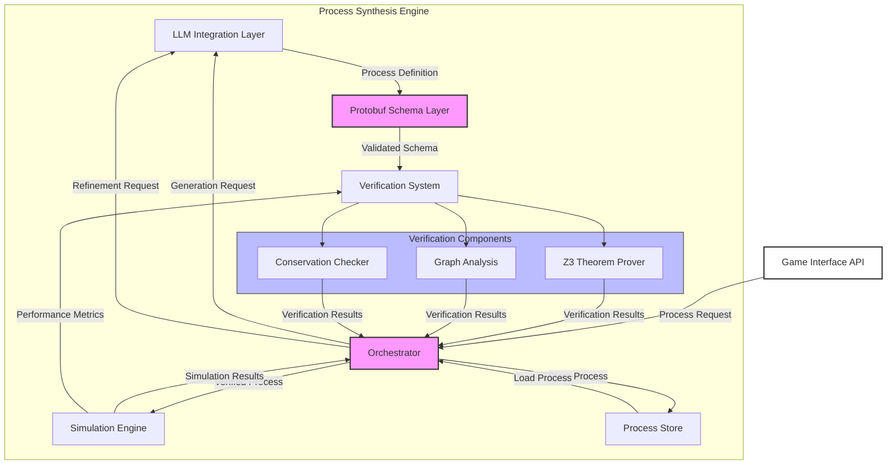

## Process Synthesis Engine (PSE)

### Motivation
At the core of this game needs to be an absolutely rock-solid, rigorous, verifiable system of interaction. This ALSO needs to be able to be "plugged into" AI systems that can guide the generation of interesting processes within this system, and the holy grail is to have interesting "emergent" higher-level processes generated each run.

Achieving a system with this robustness and flexibility will require many different sub-systems and combinations of existing tools/strategies.
Claude puts it well:
```
The engine combines formal verification tools with LLM-guided generation to create process networks that are both scientifically plausible and mechanically interesting for gameplay
```

### PSE 1.0
Core Components:
1. Orchestrator: Central coordinator for all PSE operations
2. Protobuf Schema Layer: Defines and validates process structures
3. LLM Integration Layer: Handles process generation and refinement
4. Verification System: Ensures process validity
5. Simulation Engine: Tests process behavior
6. Process Store: Persists validated processes

Verification Components:
1. Z3 Theorem Prover: Validates resource conservation
2. Graph Analysis: Checks process networks and cycles
3. Conservation Checker: Ensures resource laws are maintained



I have worked with almost none of these directly before so yee-haw 🤠
