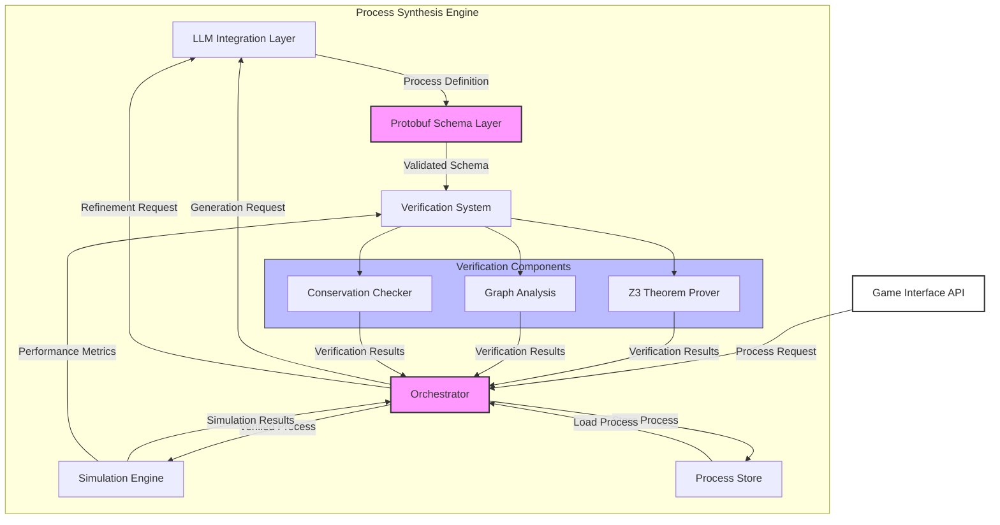

# Process Synthesis Engine (PSE)

## Motivation
At the core of this game needs to be an absolutely rock-solid, rigorous, verifiable system of interaction. This ALSO needs to be able to be "plugged into" AI systems that can guide the generation of interesting processes within this system, and the holy grail is to have interesting "emergent" higher-level processes generated each run.

Achieving a system with this robustness and flexibility will require many different sub-systems and combinations of existing tools/strategies.
Claude puts it well:
```
The engine combines formal verification tools with LLM-guided generation to create process networks that are both scientifically plausible and mechanically interesting for gameplay
```

## PSE 1.0
Core Components:
1. Orchestrator: Central coordinator for all PSE operations
2. Protobuf Schema Layer: Defines and validates process structures
3. LLM Integration Layer: Handles process generation and refinement
4. Verification System: Ensures process validity
5. Simulation Engine: Tests process behavior
6. Process Store: Persists validated processes

Verification Components:
1. Z3 Theorem Prover: Validates resource conservation
2. Graph Analysis: Checks process networks and cycles
3. Conservation Checker: Ensures resource laws are maintained



I have worked with almost none of these directly before so yee-haw 🤠

### Protobuf Schema

1. Resources
  - Resources exist within a grid cell. There are matter, energy, and information resources that each come in 3 qualities (Low, Medium, High)

2. Operations
  - Operations are actions that can be chained together into a Process. There are three types of operations:
    - Transfer
      - Move X resources from this cell to a neighboring grid cell
    - Transform
      - Convert resource X into resource Y on this grid cell
    - Sense
      - Sense the amount of resource X on this grid cell or adjacent cells; stop or continue the current process based on result

3. Processes
  -  A series of operations that run in a specific grid cell. 

### Order

Order is resolved by information quantity. That is, the grid cell with the most information runs its processes first, then the grid cell with the second most, etc.

May also try:
- Random?
- Top to bottom left to right
- Simultaneous (would need to majorly reformat base actions)
- Highest information
- Color matters?

### Quality
High quality resources will have the best "persistance" and "predictability". Maybe Low quality information is leaky to nearby cells in a random way thats uhelpful, etc.
